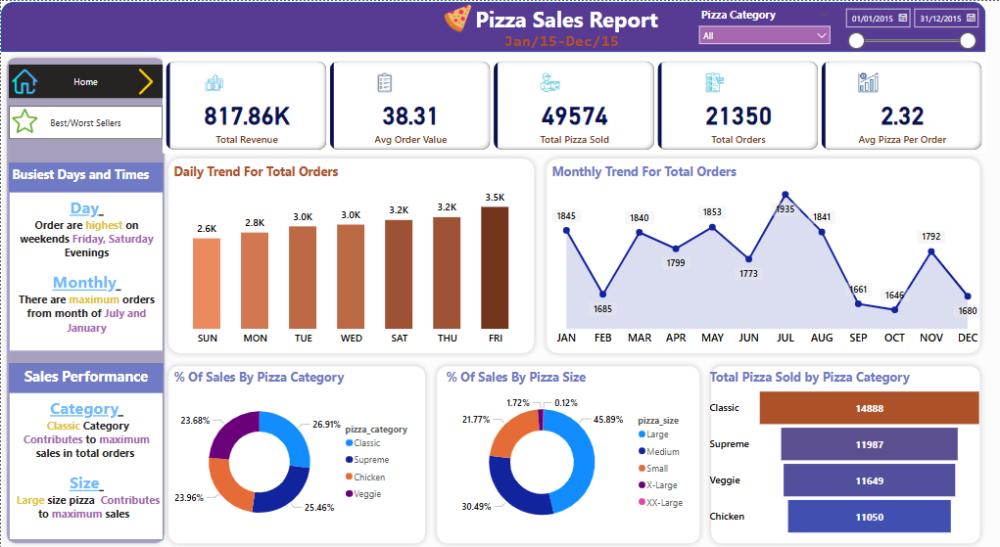
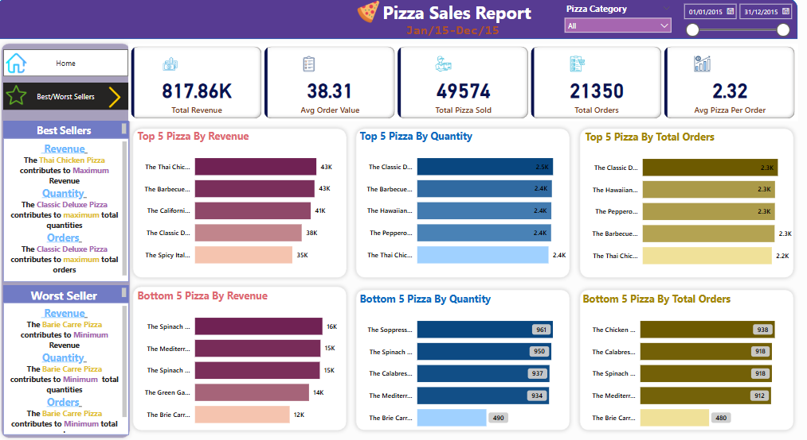

# 🍕 Pizza Sales Report Dashboard

## 📊 Overview

This interactive Power BI dashboard presents an insightful analysis of pizza sales between **January 15 and December 15**. The goal was to transform raw data into actionable business intelligence by identifying key trends in order patterns, revenue, and sales performance across categories and sizes.

> 🚀 Designed to help business stakeholders make data-driven decisions around product offerings, promotional timing, and sales strategies.

---

## 🧠 Key Insights

### 📅 Busiest Days & Times

* **Order Volume Peaks** on **Fridays and Saturday evenings**.
* **Monthly Peaks** occur in **July** and **January**.

### 📈 Sales Metrics

* **Total Revenue**: **817.86K**
* **Average Order Value**: **38.31**
* **Total Orders**: **21,350**
* **Total Pizzas Sold**: **49,574**
* **Average Pizzas per Order**: **2.32**

### 🔄 Trend Highlights

* **📅 Daily Orders Peak** on **Fridays (3.5K)**.
* **📅 Monthly Peak** observed in **July (1935 orders)**.

### 🏆 Sales Performance

* **Top Category**: *Classic* pizzas contribute most to total revenue and orders.
* **Top Size**: *Large* pizzas are the best-selling by size.

### 🔥 Best Sellers

* **💰 Highest Revenue Contributor**:

  * *Thai Chicken Pizza* generates the **maximum revenue**.
* **📦 Most Ordered by Quantity**:

  * *Classic Deluxe Pizza* sold the **highest quantity**.
* **🧾 Most Frequent Orders**:

  * *Classic Deluxe Pizza* also had the **highest total orders**.

### 🧊 Worst Sellers

* **💰 Lowest Revenue Contributor**:

  * *Barie Carre Pizza* generates the **least revenue**.
* **📦 Least Ordered by Quantity**:

  * *Barie Carre Pizza* had the **lowest quantity sold**.
* **🧾 Least Frequent Orders**:

  * *Barie Carre Pizza* also had the **lowest number of orders**.

---

## 📌 Features

* **Fully interactive Power BI dashboard**
* Time filter to view sales for custom date ranges
* Dynamic slicers for **Pizza Category** selection
* Visuals include:

  * Bar and line charts for order trends
  * Donut charts for category & size distribution
  * Best/Worst Selling Pizza highlights
  * KPIs for instant performance overview

---

## 💡 Skills Demonstrated

* **Data Visualization** with Power BI
* **Business Intelligence & Data Storytelling**
* **DAX** for calculated metrics
* **UI/UX Design** for dashboards
* **Problem Solving & Insight Extraction**

---

## 🔗 Dashboard Preview

